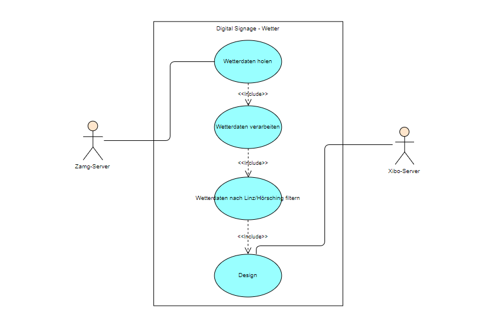

<h1>Pflichtenheft</h1>
<h2>1. Ausgangslage</h2>
    
Wir sind drei Schülerinnen der Höheren Technischen Bundeslehranstalt in Leonding und besuchen derzeit die 3. Klasse der Abteilung für Medientechnik. Unsere Namen sind Juliana Naderer, Schirin Turko und Eva Hildenbrand. Da wir in unseren drei Ausbildungsjahren schon öfter zusammen gearbeitet haben, werden wir auch dieses Projekt miteinander machen. Unser Programm soll die aktuelle Wetterlage in Linz/Hörsching von Österreich anzeigen.

<h2>2. Ist-Zustand</h2>
    
Für unser Projekt benötigen wir 
        <ul>
            <li>unsere Laptops
            <li>die Datei tawes1h.csv (<a href="http://www.zamg.ac.at/ogd/">http://www.zamg.ac.at/ogd/</a>), in welcher Städte mit gewissen Temperaturen verzeichnet sind
            <li>Zugriff auf den Server von Zamg (<a href="https://www.zamg.ac.at">https://www.zamg.ac.at</a>)
        </ul>
        Diese benötigten "Dinge" besitzen wir schon, bzw. wir haben Zugriff darauf.
    

<h2>3. Zielsetzung</h2>
    

        <ul>
            <li>Wetterdaten der Datei tawes1h.csv lesen und auf einer Website ausgeben
            <li>Wetterdaten von dem Server (<a href="https://www.zamg.ac.at">https://www.zamg.ac.at </a>) holen und auf der Website ausgeben
            <li>Code als Layout am Xibo einbinden
            <li>Stündliche automatische Aktualisierung der Wetterlage
            <li>Designen: 
                <ul type="square">
                    <li>Daten von Linz/Hörsching ausgeben
                    <li>Aktueller Wetterlage/Tageszeit darstellen
                    <li>evtl. Sonnenstand anzeigen
                </ul>
        </ul>
    

<h2>4. Anforderungen</h2>
    
Durch das Xibo-Layout soll man über die aktuelle Wetterlage in Linz/Hörsching informiert werden. Die Website aktualisiert sich jede Stunde und soll übersichtlich sowie benutzerfreundlich sein.  
    Unsere Usecases sind:
        <li> Als Schülerin und Schüler bzw. Lehrperson möchte ich die aktuelle Außentemperatur am Digital Signage sehen, damit ich weiß, wie warm bzw. kalt es draußen ist.
        <li>Als Schülerin und Schüler bzw. Lehrperson möchte ich mich über die aktuelle Windgeschwindigkeit am Digital Signage informieren können, um ca. einzuschätzen wie stark der Wind gerade weht.
        <li>Als Schülerin und Schüler bzw. Lehrperson möchte ich über den   
        aktuellen Niederschlag pro m² am Digital Signage informiert werden.
        <li>Als Schülerin und Schüler bzw. Lehrperson möchte ich (grafisch) über den aktuellen Sonnenstand und die Tageszeit am Digital Signage informiert werden.
    
    

<h2>5. Mengengerüst</h2>
    
Das Xibo-Layout soll am Digital Signage dargestellt werden. Die Datenmenge soll jedoch relativ klein bleiben, da die Wetterdaten von der Datenbank jede Stunde aktualisiert werden.
    
