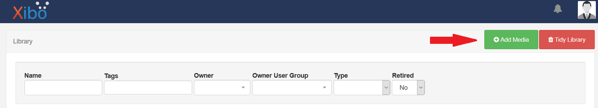

<h1>DigitalSignageWeather</h1>

<h3>Am Xibo einbinden</h3>
<p>
    Um den Code am Xibo einzubinden, benötigt man mehrere Schritte.<br>
    Als erstes muss man die 4 Bilder aus dem images-Ordner (bgDay,bgNight,bgTwilight,bgRain) auf den Xibo hochladen.<br>
    Dafür geht man unter den Menüpunkt "Media" und klickt auf "Add media". Es wird sich ein kleines Fenster öffnen.<br>
    
    
    In diesem klickt man zuerst auf "Add files" und wählt die 4 Bilder aus. Dann drückt man auf "Start upload" und <br>
    sobald die Bilder hochgeladen sind, drückt man auf "Done".<br>
    
    Anschließend muss man ein neues Layout erstellen.<br>
    Dafür geht man unter den Menüpunkt "Layouts" und klick auf "Add Layout".<br>
    
    
    Man wählt einen Namen für das Layout aus und speichert es ab.<br>
    
    Danach macht man einen Doppelklick auf die schon vorhandene Region. Auch hier öffnet sich wieder ein Fenster.<br>
    
    
    
    Hier geht man unter den Punkt "Embedded" und fügt den Code wie folgt ein:<br>
</p>
    HTML to Embed:

    ````HTML
        <link rel="stylesheet" href="https://fonts.googleapis.com/icon?family=Material+Icons">
        <link rel="stylesheet" href="https://use.fontawesome.com/releases/v5.7.0/css/all.css" integrity="sha384-lZN37f5QGtY3VHgisS14W3ExzMWZxybE1SJSEsQp9S+oqd12jhcu+A56Ebc1zFSJ" crossorigin="anonymous">
        <div id="weatherContainer">
            <p id="location">
                Leonding <br>
                <span id="time"></span>
            </p>
            <div id="tempContainer">    	
                <p id="outputTemp"></p>
                <i id="moonIcon" class="fas fa-moon"></i> 
                <i id="sunIcon" class="material-icons">wb_sunny</i><br>
            </div><br>
            <div id="windContainer">
                <i id="windIcon" class="fas fa-wind"></i>
                <p id="outputWindSpeed"></p>
            </div><br>
            <div id="rainFallContainer">
                <i id="rainIcon" class="fas fa-cloud-showers-heavy"></i>
                <p id="outputRainFall"></p>
            </div>
        </div>
        <div id="drops-section"></div>
    ````
   Custom Style Sheets:
   
   ````CSS
    <style type="text/css">
        body {
            padding: 0;
            margin: 0;
            font-family: sans-serif;
            /* text-align: center; */
            overflow: hidden;
            background-size: 100%;
            background-repeat: no-repeat;
        }
        #outputTemp, #outputWindSpeed, #outputRainFall  {
            font-size: 400%;
            z-index: 1;
            text-shadow: 2px 2px 4px #000000;
        }
        #weatherContainer{
            width: 40%;
            height: 5%;
            border: black 5px solid;
            border-radius: 15px;
            box-shadow: 3px 4px 8px 0 rgba(0, 0, 0, 0.692), 0 6px 20px 0 rgba(255, 255, 255, 0.295);
            margin-left: 3%;
            margin-top: 2%;
            padding-left: 3%;
            padding-right: 3%;
            background-color: rgba(191, 191, 191, 0.5);
        }
        #location span{
            font-size: 100%;
        }
        #location{
            font-size: 500%;
            text-shadow: 2px 2px 4px #000000;
            padding-top: 3%;
        }
        #tempContainer #sunIcon, #tempContainer #moonIcon, #outputTemp{
            display: inline-block;
            margin-top: -10%;
            float: right;
            margin-left: 3%;
            font-size: 500%;
        }
        #windContainer #windIcon, #outputWindSpeed{
            display:inline-block;
        }
        #rainFallContainer #rainIcon, #outputRainFall{
            display:inline-block;
            margin-top: -2%;
        }
        #sunIcon, #windIcon, #rainIcon, #moonIcon{
            font-size: 300%;
            text-shadow: 2px 2px 4px #000000;
        }
        #sunIcon, #outputTemp, #moonIcon{
            font-size: 500% !important;
        }
        #sunIcon, #moonIcon{
            color: #ffff99;
        }
        #moonIcon{
            opacity: 0;
        }
        #sunIcon{
            margin-right: -15%;
        }
        #windIcon, #rainIcon{
            color: #cccccc;
            margin-right: 3%;
        }
        .rainDrop {
            position: absolute;
            background: linear-gradient(180deg, white , black 90%, black);
            border-radius: 100% 100% 80% 80%;
        }
    </style>
    ````

   HEAD content to Embed(including script tags):

`   ```Javascript
   <script type="text/javascript">
    function EmbedInit()
    {
        //Stündliche aktualisierung der Daten
      $(document).ready(function() {
        setInterval(function() {
          reload_page();

          // alert("It worked");
        }, 60 * 60000); //1 Stunde
      });

      function reload_page() {
        window.location.reload(true);
      }

      let url = "http://www.zamg.ac.at/ogd/";
      let rain;

      const pageWidth = 1980;
      const pageHeight = window.innerHeight;
      const defaultDropNum = 300;

      $.ajax({
        type: "GET",
        url: "http://www.zamg.ac.at/ogd/",
        dataType: "text",
        success: function(csv) {
          let lines = csv.split(/\r?\n|\r/);
          let index = 1;
          let currentLine = lines[index].split(";");

          let outputTempIndex = 5;
          document.getElementById("outputTemp").innerHTML =
            currentLine[outputTempIndex] + " °C";
          let outputWindSpeedIndex = 9;
          document.getElementById("outputWindSpeed").innerHTML =
            currentLine[outputWindSpeedIndex] + "  km/h";
          let outputRainFallIndex = 12;
          document.getElementById("outputRainFall").innerHTML =
            currentLine[outputRainFallIndex] + "  l/m²";

          rain = currentLine[outputRainFallIndex];

          if (rain > "0") {
            updateBackground();
          }

           updateBackground();
        }
      });

      //Hintergrundfarbe je nach Zeit ändern
      function updateBackground() {
        //Einlesen der Variablen
        let hr = new Date().getHours(); //Aktuelle Stunde herausfinden
        let body = document.body;
        let bstyle = body.style;
        let actualHour = new Date().getHours();
        let actualMinutes = new Date().getMinutes();

        if(actualHour < 10){
          actualHour = "0" + actualHour;
        }
        if(actualMinutes < 10){
          actualMinutes = "0" + actualMinutes;
        }

        document.getElementById("time").innerHTML = "" + actualHour + " : " + actualMinutes;

        if(rain > "0"){
          bstyle.backgroundImage = "url('[79]')";
          makeItRain(defaultDropNum);
        }else{
          //Zwischen 19 und 21 Uhr bzw. 5 und 7 Uhr blauer Hintergrund
          if ((hr >= 19 && hr < 21) || (hr >= 5 && hr < 7)) {
            bstyle.backgroundColor = "#0059b3";
            bstyle.color = "white";
            bstyle.backgroundImage = "url('[77]')";
            document.getElementById("weatherContainer").style.border = "white 5px solid";

            document.getElementById("sunIcon").style.opacity = 1;
            document.getElementById("moonIcon").style.opacity = 0;
            //Zwischen 21 und 5 Uhr dunkelblauer Hintergrund
          } else if (hr >= 21 || hr < 5) {
            bstyle.backgroundColor = "#000066";
            bstyle.color = "white";
            bstyle.backgroundImage =  "url('[76]')";
            document.getElementById("weatherContainer").style.border = "white 5px solid";

            document.getElementById("sunIcon").style.opacity = 0;
            document.getElementById("moonIcon").style.opacity = 1;
            //Zwischen 7 und 19 Uhr hellblauer Hintergrund
          } else if (hr >= 7 && hr < 19) {
            bstyle.backgroundColor = "#ccefff";
            bstyle.color = "black";
            bstyle.backgroundImage = "url('[78]')";

            document.getElementById("sunIcon").style.opacity = 1;
            document.getElementById("moonIcon").style.opacity = 0;
            //Sonst weißer Hintergrund
          } else {
            bstyle.backgroundColor = "white";
            bstyle.color = "black";
          }
        }
      }
        
      //Jede Minute die Funktion updateBackground aufrufen
      setInterval(updateBackground, 1000 * 60);

      //Funktion für den Regen
      function makeItRain(num) {
          let elements = document.getElementById("drops-section");

          while (elements.hasChildNodes()) {
            elements.removeChild(elements.lastChild);
          }
          for (let i = 0; i < num; i++) {
            let randomX = Math.floor(Math.random() * pageWidth);
            let randomY = Math.floor(Math.random() * pageHeight);
            let dropSpeed = Math.floor(Math.random() * (25 - 5)) + 5;
            let dropWidth =
              Math.floor(Math.random() * (dropSpeed / 10 - 1)) + 1;
            let dropHeight =
              Math.floor(Math.random() * (dropSpeed * 2 - 3)) + 3;
            let d = new Drop(
              randomX,
              randomY,
              dropSpeed,
              dropWidth,
              dropHeight
            );

            d.show();
            d.fall();
          }
        }

        class Drop {
            constructor(xPosition, yPosition, dropSpeed, dropWidth, dropHeight) {
                this.xPosition = xPosition;
                this.yPosition = yPosition;
                this.dropSpeed = dropSpeed;
                this.dropWidth = dropWidth;
                this.dropHeight = dropHeight;
                this.element;
            }
            
        show() {
                this.element = document.createElement("div");
                this.element.className += "rainDrop";
                this.element.style.top = this.yPosition + "px";
                this.element.style.left = this.xPosition + "px";
                this.element.style.width = this.dropWidth + "px";
                this.element.style.height = this.dropHeight + "px";

                let el = document.getElementById("drops-section");
                el.appendChild(this.element);
            }
            
        fall() {
                const makeItRain = () => {
                    this.yPosition = this.yPosition + this.dropSpeed;
                    this.element.style.top = this.yPosition +"px";

                    if(this.yPosition < window.innerHeight) {
                        requestAnimationFrame(makeItRain);
                    } else {
                        this.yPosition = -10;
                        requestAnimationFrame(makeItRain);
                    }

                }

                requestAnimationFrame(makeItRain);
        }
        }
        return;
    }
</script>

````