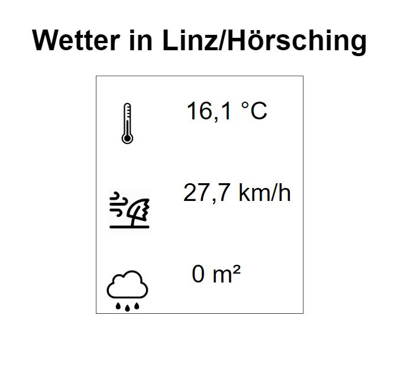

<h1>Xibo</h1>

Unser Xibo-Layout trägt den Namen "2018/19_itp_3ahitm_ds_weather" und die id 154.  
Wir verwenden Xibo, um das aktuelle Wetter auf dem Digital Signage anzuzeigen.  
Die Bilder haben wir unter dem Punkt Library in Media auf den Xibo-Server hochgeladen. Da es nicht funktioniert hat, die Bilder mit deren ID in unser Layout einzubinden, haben wir einen Rechtsklick auf das Bild gemacht und die Bildadresse kopiert. Diese haben wir dann im image-Tag in unserem Layout eingebunden. 
Nach dem Einbinden der Bilder sieht unser Layout derzeit am Xibo so aus:

